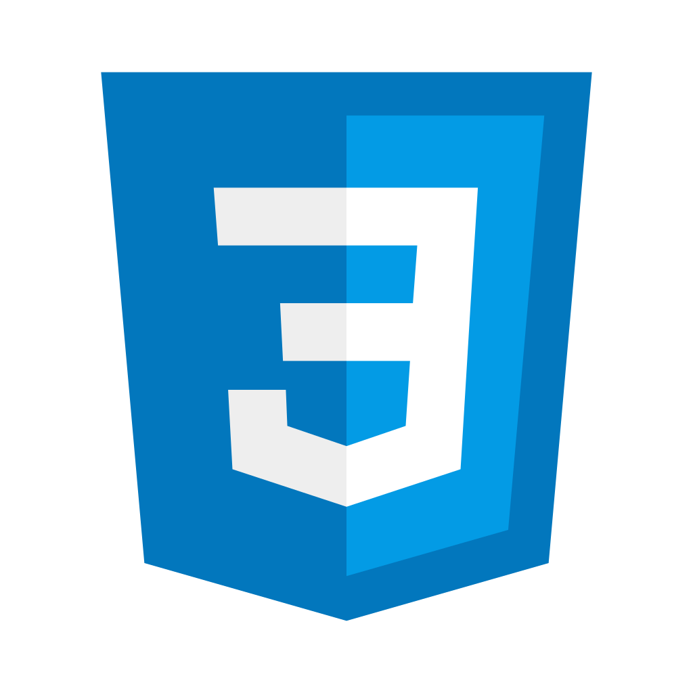
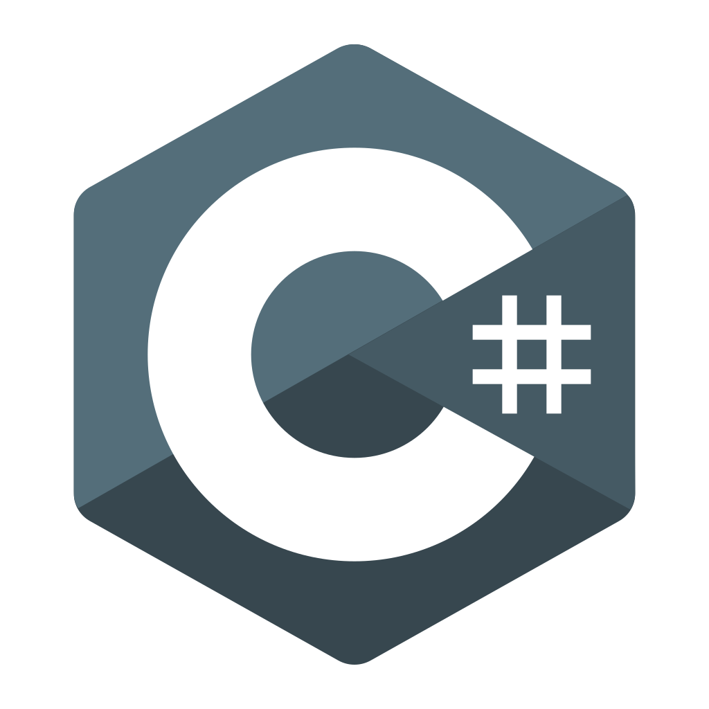
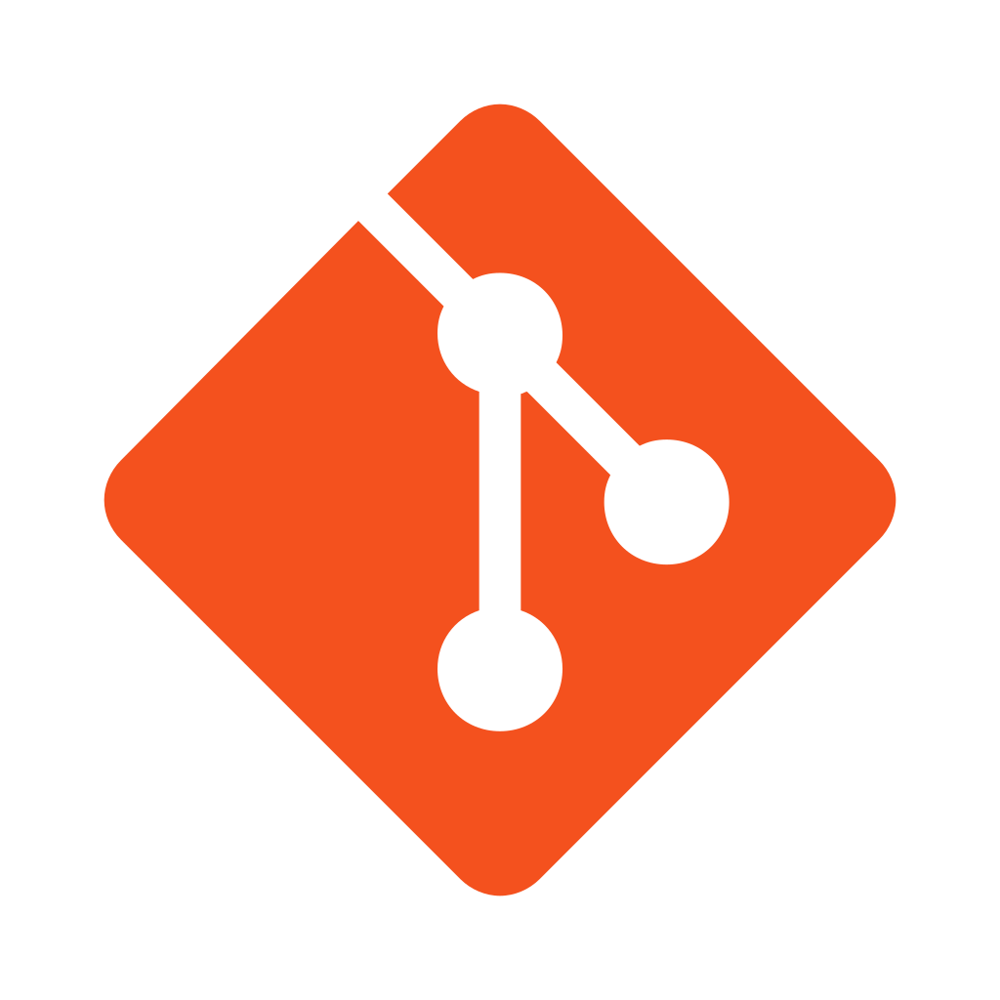
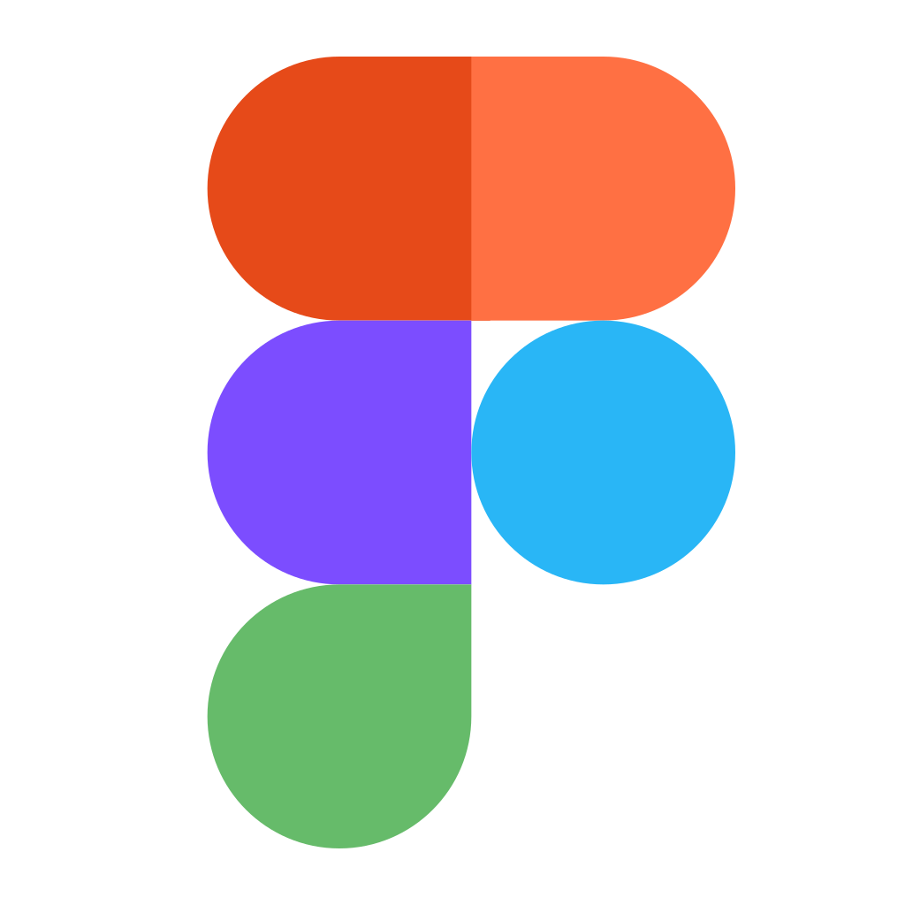
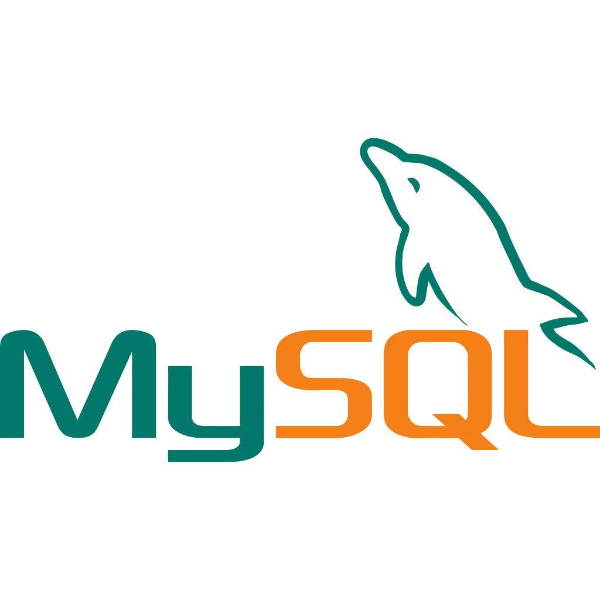

<h1 align="center">Hi 👋 My name is Aleksei</h1>
<h3 align="center">Front-end Developer</h3>

🚩 Nizhny Novgorod

        
        
        
        

<h2>👦 About me</h2>

I am a Front-end Developer from Russia

<ul>
        <li></li>
</ul>
<h2>🛠 Languages and Tools</h2>

        
        
        
        

        
        
        
        

<h2>👨‍💻 My stats</h2>

<!--
**Aleksei-Kireev/Aleksei-Kireev** is a ✨ _special_ ✨ repository because its `README.md` (this file) appears on your GitHub profile.

Here are some ideas to get you started:

- 🔭 I’m currently working on ...
- 🌱 I’m currently learning ...
- 👯 I’m looking to collaborate on ...
- 🤔 I’m looking for help with ...
- 💬 Ask me about ...
- 📫 How to reach me: ...
- 😄 Pronouns: ...
- ⚡ Fun fact: ...
-->
